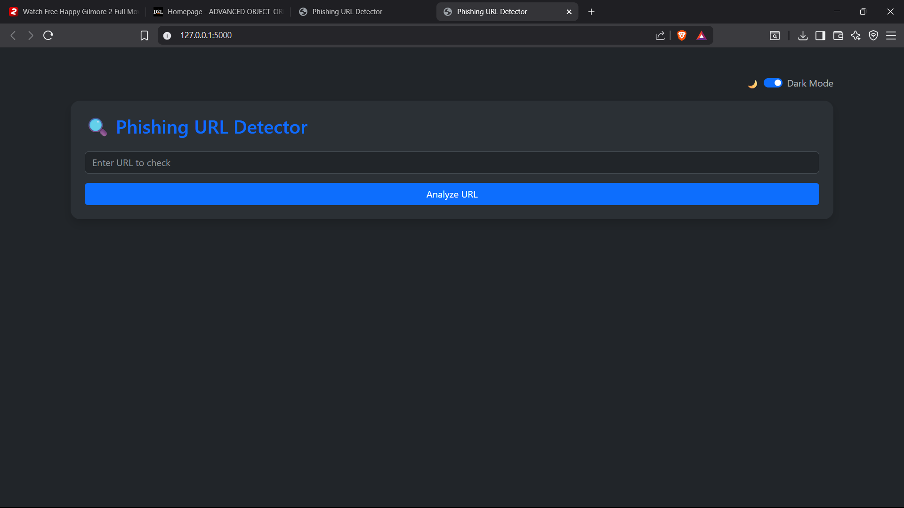

Phishing URL Detector

A Python-based phishing detection tool with a simple web interface built using Flask. It uses multiple heuristics to assess whether a URL may be malicious, including domain age, suspicious keywords, HTTPS checks, and AbuseIPDB reputation.




Features

- Suspicious keyword detection
-  WHOIS-based domain age check
-  HTTPS verification
-  URL shortener detection
-  AbuseIPDB reputation lookup
-  Final phishing risk score (0–5)
-  CLI tool & Flask web app
-  Dark mode toggle (🌙/☀️)
-  Bootstrap-styled UI


Tech Stack

- Python 3
- Flask
- WHOIS
- Requests
- AbuseIPDB API
- Bootstrap 5 (with Dark Mode)


Installation

```bash
git clone https://github.com/yourusername/phishing-url-detector.git
cd phishing-url-detector
python -m venv venv
venv\Scripts\activate  # On Windows
pip install -r requirements.txt
